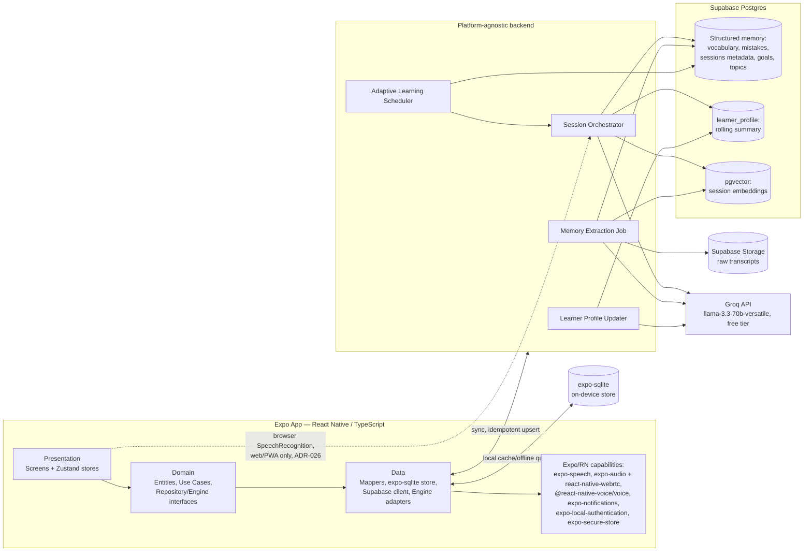

# ARCHITECTURE.md

Technical architecture for the personal AI English coach. Complements `PROJECT.md` (why) with the how. Implements confirmed decisions D1–D4 (`PROJECT.md` §8) plus the improvements approved in the 2026-08-06 Architecture Review, **and the 2026-08-07 client platform migration to React Native + Expo** — see `ARCHITECTURE_DECISIONS.md` for the full rationale behind every decision referenced here as `ADR-xxx`, and `RN_EXPO_MIGRATION_PLAN.md` for the migration's full technical analysis.

This document owns **structure and design** (layers, data model, sync mechanics, subsystem responsibilities). Five companion specifications own their own domains and are the canonical source where referenced: `PROMPT_ENGINE.md` (AI behavior/prompting), `LEARNING_ENGINE.md` (pedagogical formulas), `DESIGN_SYSTEM.md` (visual identity), `NON_FUNCTIONAL_REQUIREMENTS.md` (measurable targets), `OBSERVABILITY.md` (monitoring detail). Where this document previously stated a number or formula now owned elsewhere, it points there instead of repeating it, to avoid two sources of truth.

**Status: Frozen for Phase 0 implementation start**, pending nothing further on the architecture side. `IMPLEMENTATION_PLAN.md` macro-stages 1–4 are being re-authored for this stack; macro-stage 1 has not yet begun.

---

## 1. Platform target

- **Client**: **React Native + Expo** (latest stable SDK at implementation time — verify against `docs.expo.dev`), **TypeScript** (`strict: true`), targeting **iOS, Android, and Web/PWA** (via React Native Web) from one codebase (ADR-019). Android support is a natural byproduct of the framework choice, not a separate goal — not previously planned under the native-Swift architecture, worth noting as an incidental gain.
- iOS remains the **primary, full-capability surface** (voice, biometric app-lock, reliable background sync). Web/PWA is a deliberate **companion surface** — progress review, history, text-based sessions — not full parity (ADR-024). This distinction is load-bearing throughout this document; a capability described as "native" below means iOS/Android unless stated otherwise.
- TypeScript strict mode adopted from day one, not opted into gradually — the direct successor to the prior Swift-6-strict-concurrency stance (`RISKS.md` R-12's "pay the rigor cost once, early" principle), now expressed as TypeScript's own strictness flags.
- Monorepo structure: an Expo app (Presentation) consuming a workspace package, `packages/core` (Domain + Data), further split into a dependency-free domain subpackage and a data subpackage — see §2.1 and ADR-021.

## 2. Architecture pattern: MVVM + Clean Architecture

Three layers, dependencies point inward (Presentation → Domain ← Data); **Domain has no knowledge of React Native, `expo-sqlite`, Supabase, or any vendor SDK — not even indirectly.** This was the main finding of the original architecture review and remains the governing rule after the platform migration (ADR-006, reaffirmed with a technology-note update, `ARCHITECTURE_DECISIONS.md`).

```
apps/mobile/            Expo app — Presentation: screens, Zustand stores (ViewModels), navigation (Expo Router)
packages/core/domain/   Entities, Use Cases, Repository protocols (TS interfaces), Engine protocols — pure TS, framework-free
packages/core/data/     Repository implementations, Mappers, expo-sqlite store, Supabase client, Engine adapters
```

### 2.1 Domain/Data boundary: monorepo workspace packages, not Swift Package targets

The original design (pre-migration) enforced this boundary via two Swift Package Manager targets — a real compiler error on violation (ADR-018). That mechanism doesn't exist in TypeScript. The replacement (ADR-021): **`packages/core` is split into two workspace packages**, `@coach/domain` (zero runtime dependencies — not even a `package.json` dependency on `expo-sqlite` or `@supabase/supabase-js`) and `@coach/data` (depends on `@coach/domain` plus the persistence/network SDKs), **plus an ESLint boundary rule** (`eslint-plugin-boundaries` or equivalent) as defense-in-depth. A domain file attempting `import { ... } from '@coach/data'` fails at module resolution, not just at lint time — weaker than Swift's guarantee (lint-time/build-time, not a language-level compile error) but real, CI-checkable, and not merely a review-time convention.

```typescript
// @coach/domain — framework-free, zero runtime dependencies
export interface SessionRepository {
  fetchRecent(limit: number, offset: number): Promise<Session[]>;
  save(session: Session): Promise<void>;
  observeLocal(): AsyncIterable<Session[]>;   // reactive UI updates
}

export interface MemoryRepository {
  recentMistakes(limit: number): Promise<Mistake[]>;
  vocabulary(due: boolean): Promise<VocabularyItem[]>;
  topicCoverage(): Promise<Topic[]>;
}

export interface SyncCoordinating {
  syncNow(): Promise<void>;
  readonly pendingChangesCount: number;
}
```

```typescript
// @coach/data — the only package allowed to import expo-sqlite or the Supabase SDK
export class DefaultSessionRepository implements SessionRepository {
  constructor(
    private readonly local: SqliteSessionStore,
    private readonly remote: SupabaseSessionApi,
  ) {}
  // reads local first, writes local + queues remote, never exposes the raw SQLite row shape to callers
}
```

A small **Mapper** layer (`sessionMapper`, `vocabularyMapper`, …) converts between the `expo-sqlite`/Drizzle row shape, the pure Domain entity type, and the Supabase DTO — each conversion lives in exactly one place, so a schema change touches one mapper, not every store/screen.

### 2.2 Use cases (initial set — enumerated so implementation doesn't drift into ad hoc access patterns)

`StartSessionUseCase`, `EndSessionUseCase`, `GetAdaptiveFocusUseCase`, `SyncMemoryUseCase`, `SearchMemoryUseCase`, `ExportUserDataUseCase`, `DeleteUserDataUseCase`. Each takes its repository/engine dependencies via constructor injection — no singletons, no service locator (ADR-012, unchanged in principle).

### 2.3 Dependency Injection: composition root, no DI framework

A single `container.ts`, built once at app startup, constructs every concrete repository/engine/mapper and injects them into use cases and stores via plain constructor calls — the direct TypeScript expression of ADR-012's `AppContainer`:

```typescript
// container.ts — the only place concrete types are instantiated
export function createContainer(): AppContainer {
  const db = createSqliteDb();
  const supabase = createSupabaseClient();
  const sessionRepository = new DefaultSessionRepository(db, supabase);
  // ...wire every repository/engine/use case here, once
  return { sessionRepository, /* ... */ };
}
```

No third-party DI container, no decorator-based injection magic, no service locator — for a solo-maintained, multi-year codebase, an explicit composition module is the cheapest thing to *read* correctly five years from now, exactly the reasoning ADR-012 recorded originally.

### 2.4 SOLID / DDD assessment

| Principle | Assessment | Action |
|---|---|---|
| SRP | Engine and Repository interfaces are single-purpose | Kept as-is |
| OCP | Provider swap = new Data adapter, no Domain/Presentation change | Kept as-is |
| LSP | Untested until a second concrete adapter exists per interface | Recommended: build a minimal second `ConversationEngine` adapter early as a proof, not just in theory (`TASKS.md` T0-13) |
| ISP | Interfaces already narrow (no fat "AIService" god-interface) | Kept as-is |
| DIP | Was violated by direct SwiftData access from Presentation in the original design; the same rule now applies to `expo-sqlite`/Supabase | **Enforced** — §2.1 |
| DDD | Full DDD is more ceremony than a single-user app needs | Pragmatic subset only: typed value objects (`CEFRLevel`, `MasteryLevel`, `SessionCategory` as TS union types/enums) plus one lightweight domain event, `SessionCompletedEvent`, decoupling "session ended" from "trigger sync + extraction" — recommended, not mandatory (`TASKS.md` T1-11) |

## 3. High-level system



**2026-08-10 (ADR-025/ADR-026, zero-cost constraint):** the reasoning engine is Groq, not Anthropic Claude — the principle below is otherwise unchanged. Voice input no longer routes through a backend-issued realtime token (OpenAI Realtime is gone entirely); the browser's own `SpeechRecognition` API converts speech to text client-side, on web only, and that text enters the normal conversation flow like any typed message — voice is now a client-side input method feeding the same orchestration path, not a parallel backend engine. The client never talks to Groq directly; keys live only in the backend, same as the original Claude design.

## 4. Local persistence & sync (`expo-sqlite` ↔ Supabase)

**Supabase Postgres remains the sole source of truth.** `expo-sqlite` (with Drizzle ORM as a type-safe query/schema layer, ADR-020) is a durable local cache plus offline write queue — the direct successor to SwiftData in this role, with the same architectural contract. Every rule below is unchanged in substance from the original design; only the storage engine underneath changed:

1. **Idempotent writes.** Every upload from `SyncCoordinator` is a Postgres `upsert` keyed on a stable client-generated UUID (`localID`, sent as the row's primary key candidate), not a bare insert. An interrupted upload that retries can never create a duplicate row (ADR-007).
2. **Per-device sync cursor.** A local `sync_state` table (`expo-sqlite`) stores `lastSyncedAt`; pulls request only rows changed since that watermark, paginated. A companion `device_sync_state` table server-side records the same watermark per device for diagnostics and multi-device readiness (iPad, a future Android tablet, the web/PWA session itself counting as its own "device" for this purpose).
3. **Derived, not synced, streaks.** `streaks.current_streak_days` / `longest_streak_days` are **computed from `sessions.started_at`**, never stored as an independently mutable field — removes an entire class of sync conflicts by construction (ADR-007).
4. **Hybrid realtime + pull sync.** Lightweight, high-value fields (streak, "new achievement") use a Supabase Realtime subscription for near-instant cross-device reflection; bulk data uses the watermark-based pull to keep network usage low and predictable.

Conflict resolution (unchanged in substance):
- *Append-only tables* (`sessions`, `vocabulary_items`, `mistakes` as new occurrences) — no merge needed, new rows just insert.
- *Mutable aggregate fields* (`topics.status`, `goals.achieved`, vocabulary `mastery_level`) — server `updated_at` wins, paired with a non-blocking UI notice so a resolution is never silent.
- Memory Extraction only ever runs server-side, after a transcript successfully uploads; an offline session queues for extraction rather than attempting it on-device.

**Recovery paths:**
- Interrupted sync → retried on next connectivity with exponential backoff; idempotent upserts make retries safe.
- Corrupted/unreadable local `expo-sqlite` database → detected at launch, local cache is rebuilt from Supabase (source of truth), not treated as data loss.
- Schema evolution → Drizzle's migration-file mechanism for the local store; Postgres changes ship as versioned migration files (Supabase CLI), additive-only by default; destructive changes require a reviewed backfill script tested against a data copy first.

**Backup & restore (unchanged from the original design):**
- Supabase point-in-time recovery enabled (accepted cost trade-off under the moderate budget, D4).
- A weekly scheduled export (Edge Function → structured JSON, uploaded to Supabase Storage **and** mirrored to a second, user-owned location) so a Supabase account-level incident is not a single point of failure for years of memory.

**Platform note (ADR-024):** the web/PWA target's IndexedDB-backed storage (React Native Web's `expo-sqlite` equivalent, or a web-specific fallback — verify current library support at implementation time) plays the same local-cache role for that surface, but background sync there is best-effort (Service Worker `periodicSync`, Chrome-family only) rather than the reliable `expo-background-task`-driven scheduling iOS/Android get — consistent with the web target's companion-surface framing, not a bug to fix later.

## 5. Core subsystems

### 5.1 Conversation orchestration

Flow unaffected by either platform migration, entirely backend-side: load context → ask the Adaptive Learning Scheduler what to prioritize → stream a conversation from the `ConversationEngine` adapter → enqueue Memory Extraction on session end (via `SessionCompletedEvent`, §2.4).

**2026-08-10 (ADR-025, zero-cost constraint):** the `ConversationEngine` adapter is now **Groq** (`llama-3.3-70b-versatile`, free tier), not Anthropic Claude — a Data-layer swap behind the same Domain protocol (ADR-002/ADR-005), not a change to this flow. Chosen over Google Gemini's larger free-tier quota specifically because Groq's tier doesn't train on submitted conversations (`RISKS.md` R-09). Free-tier rate limits (1,000 requests/day, 30 RPM) replace per-token billing as the operative usage constraint — see `RISKS.md` R-06/R-15.

### 5.2 Long-term memory (Principle 1) — hierarchical, not flat

Unchanged, entirely backend-side:

- **`learner_profile`** — a single, continuously-updated compact document per user, updated incrementally by a **Learner Profile Updater** job after each session. Included in **every** session's context by default.
- **Session-level structured + semantic memory** used for targeted retrieval on top of the profile.
- Weekly/monthly rollup summaries remain deliberately deferred (ADR-009).

Retrieval is **hybrid**: filter by category/topic/recency first, then rank by embedding similarity within that filtered set.

### 5.3 Adaptive learning engine (Principle 2 & 3)

Unchanged, entirely backend-side; `GetAdaptiveFocusUseCase` (Domain, client-side) accepts an optional **upcoming real-world event** input, reserved since before the migration and unaffected by it.

```
priority(topic) = w1 * recency_decay(last_seen)
                + w2 * error_frequency(topic)
                + w3 * topic_weight(business=0.7, daily=0.3)
                + w4 * user_stated_goal_boost
                + w5 * upcoming_event_boost   -- defaults to 0 until the feature ships
                - w6 * mastery_level(topic)
```

**Canonical definitions**: `recency_decay`, `error_frequency`, and `mastery_level` are defined precisely in `LEARNING_ENGINE.md` §3 — unaffected by the client platform, since these formulas were always backend logic.

### 5.4 Voice conversation layer (Principle 4)

**2026-08-10 (ADR-026, zero-cost constraint) — this subsystem inverted from the original iOS-primary design; treat this as current, not the description below it in spirit:**

- **Primary, web/PWA only**: the browser's native `SpeechRecognition` Web API for voice input, `expo-speech`/the browser's `SpeechSynthesis` API for output — zero cost, no OpenAI Realtime API involved at all (dropped entirely, it has no free tier). This is now the app's **only** voice-input path. React Native Web renders the same Coach screen component tree to the DOM; voice input is a web-specific code path within it, not a second UI.
- **iOS/Android (via Expo Go, ADR-026)**: **no voice input.** `@react-native-voice/voice` requires a custom EAS dev-client build, which requires the Apple Developer Program (US$99/year) to install on a physical iPhone without a Mac — declined. `expo-speech` (TTS, voice *output*) still works in Expo Go — the coach can speak, but the app cannot listen, on iOS/Android today. Surface this asymmetry explicitly in the UI (§8's capability table) rather than silently degrading.
- `react-native-webrtc` is no longer part of this subsystem — it existed only to carry OpenAI Realtime's audio transport, which is gone.
- Latency budget, interruption handling, and voice-persona-consistency requirements from the original design (`NON_FUNCTIONAL_REQUIREMENTS.md` §1/§9) still apply, now measured against browser `SpeechRecognition` + Groq (§5.1) instead of OpenAI Realtime + Claude — the numeric targets themselves need re-validation against the new stack's actual latency profile, not assumed to still hold (`RISKS.md` R-01).
- **Conditional, not permanent**: this entire section reverts to something closer to the original iOS-primary design if Julia ever lifts the zero-cost constraint (`ARCHITECTURE_DECISIONS.md` ADR-026's own framing) — the `VoiceEngine` Domain protocol (ADR-002/ADR-005) is what makes that reversion an adapter swap rather than a rewrite, same as §5.1's engine swap.

### 5.5 Progress tracking & dashboard

Unchanged: read-only screens over the local cache, reached through `MemoryRepository` (§2.1) rather than `expo-sqlite` directly.

## 6. Backend & platform independence

Unchanged core approach (Supabase Edge Functions as an owned, versioned API), now realized sooner than originally planned: the **Domain + Data layers are structured as monorepo workspace packages** (`@coach/domain`, `@coach/data`, jointly the successor to the working name `CoachKit`) from day one, consumed by the Expo app. This is what a future macOS/Windows desktop app (via Electron/Tauri, or React Native's own desktop targets, should either ever be pursued) or a future dedicated web dashboard would reuse without duplicating business logic — and, notably, **Web is no longer a hypothetical future client requiring this reasoning to pay off later**: it's a v1 target today, via the same codebase, proving the platform-agnostic-backend principle out immediately rather than eventually (ADR-013, ADR-021).

**Refinement (ADR-021):** the Domain/Data boundary is enforced by `@coach/domain` having zero runtime dependencies (a missing-package import fails at module resolution) plus an ESLint boundary rule as defense-in-depth — the direct TypeScript-ecosystem analog to ADR-018's two-Swift-Package-target compiler enforcement, real and CI-checkable though not a language-level compile error.

## 7. Security & privacy

Everything from the original design applies, with technology updates:

- **Session tokens**: `expo-secure-store` (wraps Keychain on iOS, Keystore on Android) — the direct replacement for the Keychain-only design. **The web/PWA target has no OS-level secure-storage equivalent**; session tokens there use browser storage with a shorter expected lifetime and more conservative trust assumptions, consistent with the companion-surface framing (ADR-024) — this is a real, accepted asymmetry between platforms, not an implementation gap to silently paper over.
- **App-level biometric lock**: `expo-local-authentication` (Face ID/Touch ID on iOS, biometrics on Android) — direct replacement for `LocalAuthentication`. **No biometric equivalent on web**; the web app-lock, if implemented, uses a PIN/password fallback, explicitly not WebAuthn (ADR-024).
- **Certificate pinning: deliberately not used** (ADR-010, unchanged) — the reasoning applies identically regardless of client stack.
- Backend secrets (Anthropic, OpenAI, Supabase service role) live in Supabase Edge Function environment secrets, rotated periodically.
- Raw transcripts are deliberately excluded from the local cache on every platform — this is now doubly justified: it shrinks the on-device sensitive-data surface *and* keeps the local store small as history grows (§9).
- **New**: crash reports (ADR-023, minimal Sentry RN integration, scoped to crashes/errors only) must not include transcript content or PII in their payloads — an explicit configuration requirement for whoever implements macro-stage 10's cost/usage instrumentation and any crash-reporting wiring, not an assumption.

## 8. Expo/React Native capability integration

Replaces the original native-iOS-framework table — same purpose (map each capability need to its concrete implementation, note what it serves), updated for the new stack:

| Capability | Package | Platform coverage | Serves |
|---|---|---|---|
| Speech recognition (voice input) | Browser `SpeechRecognition` Web API | **Web only** (ADR-026, 2026-08-10) — not `@react-native-voice/voice`, dropped: it needs a custom EAS dev-client build, which needs the Apple Developer Program to install on a physical iPhone without a Mac, declined | Principle 4 — the app's only voice-input path today |
| Realtime voice transport | *(removed, 2026-08-10)* | — | OpenAI Realtime API had no free tier; `react-native-webrtc` is no longer part of this stack |
| Local audio playback/recording | `expo-audio` | iOS, Android, Web | Supports whatever voice-output flow exists on a given platform |
| TTS (voice output) | `expo-speech` | iOS, Android, Web (browser `SpeechSynthesis`) | Works everywhere, including iOS/Android where voice *input* does not (2026-08-10 asymmetry, ADR-026) |
| Home-screen streak/progress widget | Isolated native Swift/WidgetKit module (no cross-platform equivalent exists) | iOS only | Principle 2 reinforcement — **deferred to post-launch** (ADR-019 consequence, `TASKS.md` T5-04) |
| Native daily reminder/streak notifications | `expo-notifications` | iOS, Android; web push has a different, more limited delivery model, not required for v1 | Habit formation over years |
| App-lock biometrics | `expo-local-authentication` | iOS, Android; web uses PIN/password fallback (ADR-024) | Defense-in-depth (§7) |
| Secure token storage | `expo-secure-store` | iOS, Android; web has a documented, weaker fallback (§7) | Session security |
| Background sync scheduling | `expo-background-task` | iOS, Android; web limited to best-effort Service Worker `periodicSync` (§4) | Data freshness without foreground dependency |
| Accessibility (VoiceOver/TalkBack, Dynamic Type/font scaling) | React Native's built-in accessibility props + `AccessibilityInfo` | iOS, Android, Web | Principle 6, and now Android parity as an incidental gain |

## 9. Data model

### 9.1 Supabase Postgres (source of truth)

**Entirely unchanged by the client platform migration** — the schema was always backend logic, deliberately platform-agnostic from the original design:

```sql
create table users (
  id uuid primary key references auth.users,
  name text not null,
  professional_role text,
  primary_goal text,
  cefr_level text,
  created_at timestamptz not null default now()
);

-- Raw transcripts stored OUT of this table — see §9.3.
create table sessions (
  id uuid primary key,                 -- client-generated UUID (localID), enables idempotent upsert
  user_id uuid references users(id),
  started_at timestamptz not null default now(),
  ended_at timestamptz,
  mode text check (mode in ('text', 'voice')),
  category text check (category in ('business', 'daily')),
  topic text,
  transcript_storage_path text,        -- pointer into Supabase Storage, not inline text
  summary text,
  summary_embedding vector(1536),
  updated_at timestamptz not null default now()
);
create index idx_sessions_user_started on sessions(user_id, started_at desc);
create index idx_sessions_embedding on sessions using hnsw (summary_embedding vector_cosine_ops);

create table vocabulary_items (
  id uuid primary key,
  user_id uuid references users(id),
  term text not null,
  definition text,
  first_seen_session_id uuid references sessions(id),
  times_used int not null default 0,
  mastery_level text check (mastery_level in ('introduced','practicing','mastered')),
  last_practiced_at timestamptz,
  updated_at timestamptz not null default now()
);
create index idx_vocab_user_mastery on vocabulary_items(user_id, mastery_level);

create table mistakes (
  id uuid primary key,
  user_id uuid references users(id),
  type text check (type in ('grammar','pronunciation','vocabulary','fluency')),
  description text not null,
  example text,
  correction text,
  occurrences int not null default 1,
  last_seen_session_id uuid references sessions(id),
  resolved boolean not null default false,
  updated_at timestamptz not null default now()
);
create index idx_mistakes_user_resolved on mistakes(user_id, resolved, type);

create table topics (
  id uuid primary key,
  user_id uuid references users(id),
  name text not null,
  category text check (category in ('business','daily')),
  status text check (status in ('not_started','introduced','practicing','mastered')),
  last_covered_session_id uuid references sessions(id),
  updated_at timestamptz not null default now()
);

create table goals (
  id uuid primary key,
  user_id uuid references users(id),
  description text not null,
  target_date date,
  achieved boolean not null default false,
  updated_at timestamptz not null default now()
);

create table achievements (
  id uuid primary key default gen_random_uuid(),
  user_id uuid references users(id),
  label text not null,
  achieved_at timestamptz not null default now()
);

create table learner_profile (
  user_id uuid primary key references users(id),
  summary text not null,
  strengths text[],
  weaknesses text[],
  version int not null default 1,
  updated_at timestamptz not null default now()
);

create table device_sync_state (
  device_id uuid primary key,
  user_id uuid references users(id),
  platform text,                       -- 'ios' | 'android' | 'web'
  last_synced_at timestamptz,
  created_at timestamptz not null default now()
);

-- streaks is a view derived from sessions, never an editable table (§4)
create view streaks as
select
  user_id,
  -- current/longest streak computed via date-gap-island window functions over started_at::date
  -- (implementation detail for macro-stage 8; contract is: always derived, never independently written)
  user_id as _placeholder_see_note
from sessions
group by user_id;
```

Note: `device_sync_state.platform` now includes `'web'` as a first-class value (was `'ios' | future: 'macos'`) — reflecting Web's promotion from hypothetical future client to present v1 target.

### 9.2 `expo-sqlite` + Drizzle (local cache, illustrative)

```typescript
// schema.ts — Drizzle schema over expo-sqlite
import { sqliteTable, text, integer } from 'drizzle-orm/sqlite-core';

export const cachedSessions = sqliteTable('cached_sessions', {
  localId: text('local_id').primaryKey(),
  remoteId: text('remote_id'),
  startedAt: integer('started_at', { mode: 'timestamp' }).notNull(),
  mode: text('mode', { enum: ['text', 'voice'] }).notNull(),
  category: text('category', { enum: ['business', 'daily'] }).notNull(),
  topic: text('topic'),
  summary: text('summary'),              // transcript itself is NOT cached locally, by design
  syncStatus: text('sync_status', { enum: ['synced', 'pendingUpload', 'pendingExtraction'] }).notNull(),
});

export const syncState = sqliteTable('sync_state', {
  id: integer('id').primaryKey(),        // singleton row
  lastSyncedAt: integer('last_synced_at', { mode: 'timestamp' }),
  deviceId: text('device_id').notNull(),
});
```

Local models intentionally omit `transcript_raw` and embeddings by default, same as the original design — full transcripts sync up but are not required to sync back down for the cache to be useful.

### 9.3 Object storage

Unchanged: raw transcripts live in **Supabase Storage** (`transcripts/{user_id}/{session_id}.txt`), referenced by `transcript_storage_path` — keeps the hot `sessions` table lean regardless of client platform.

## 10. Tech stack summary

| Layer | Choice | Rationale |
|---|---|---|
| Client platform | React Native + Expo, TypeScript (strict) | No macOS dependency for development or distribution (EAS Build); iOS + Android + Web from one codebase (ADR-019) |
| Architecture | MVVM + Clean Architecture, Repository + Engine interfaces | Testable, keeps AI providers and persistence swappable |
| Monorepo | `@coach/domain` + `@coach/data` workspace packages, ESLint boundary rule | Domain/Data enforcement without Swift Package Manager (ADR-021) |
| Navigation | Expo Router | File-based, typed routes, built on React Navigation (ADR-022) |
| State (UI) | Zustand | Lightweight ViewModel-equivalent state, no boilerplate |
| State (server cache) | TanStack Query (React Query), used only inside Repositories | Read-through caching without leaking past ADR-006's abstraction |
| Local persistence | `expo-sqlite` + Drizzle ORM | Type-safe queries/schema, closest available replacement for SwiftData's compile-time safety (ADR-020) |
| Animation | React Native Reanimated | UI-thread-driven performant motion (`DESIGN_SYSTEM.md` §6) |
| Gestures | React Native Gesture Handler | Standard Reanimated/Expo Router pairing |
| Custom graphics | React Native Skia, scoped to the voice waveform only; `react-native-svg` elsewhere | Selective adoption where its performance edge is real, not a blanket dependency (`RN_EXPO_MIGRATION_PLAN.md` §1.1) |
| Backend | Supabase Edge Functions (Deno/TS), packaged as an owned versioned API | Low-ops, platform-agnostic contract — unaffected by this migration |
| Database | Supabase Postgres + `pgvector` (HNSW index) | Structured + semantic memory, source of truth — unaffected |
| Object storage | Supabase Storage | Keeps raw transcripts out of hot query tables — unaffected |
| Auth | Supabase Auth + `expo-secure-store` + biometric app-lock (iOS/Android) | Layered security appropriate to sensitive content |
| Reasoning/generation LLM | Groq API, `llama-3.3-70b-versatile` (free tier) | Zero-cost conversation/content/profile-update engine (ADR-025, 2026-08-10) — chosen over Gemini's larger free tier specifically for its no-training-on-user-data terms (`RISKS.md` R-09) |
| Voice input | Browser `SpeechRecognition` Web API | Web/PWA only, zero cost — the app's only voice-input path (ADR-026, 2026-08-10); no OpenAI Realtime, no `@react-native-voice/voice` |
| Voice output | `expo-speech` / browser `SpeechSynthesis` | Works on iOS/Android (Expo Go) and web — the coach can speak everywhere even where it can only listen on web |
| Notifications | `expo-notifications` | Native habit reinforcement (iOS/Android) |
| Crash reporting | Sentry React Native, scoped to crashes/errors only | No zero-dependency native equivalent exists in RN (ADR-023) |
| Build/distribution | Expo Go | Zero cost, no Apple Developer Program (ADR-026, 2026-08-10) — EAS Build/Submit remains documented (`IMPLEMENTATION_PLAN.md` macro-stage 26) and unaffected in principle, just not currently being executed |
| Web delivery | React Native Web + PWA (manifest + service worker) | Primary surface for voice as of 2026-08-10 (ADR-026) — inverted from the original companion-surface framing (ADR-024), conditional on the zero-cost constraint |
| CI | GitHub Actions | Regression safety net; no macOS-runner requirement for most of the suite |

## 11. Scalability at the brief's own stated horizon

The brief explicitly targets years of daily use; this section validates the *design* against that qualitatively. Numeric targets are canonical in `NON_FUNCTIONAL_REQUIREMENTS.md` §8:

| Scenario | Risk without mitigation | Mitigation already in this design |
|---|---|---|
| Thousands of hours of conversation | Hot tables bloated with transcript text | Transcripts in object storage (§9.3), not inline |
| Hundreds of thousands of messages | No current per-message table | Deliberately deferred (Principle 5) — additive if ever needed |
| Thousands of vocabulary/mistake rows | Slow scheduler queries | Indexes on `(user_id, status/mastery)` (§9.1) |
| Multi-year embedding growth | Exact vector search slows down | HNSW index on `summary_embedding` |
| Multiple devices/platforms | Sync conflicts, duplicate rows, "who owns the streak" ambiguity | Idempotent upsert, per-device cursor, derived streaks (§4) |
| Future desktop/dedicated-web client | Business logic duplicated per platform | `@coach/domain`/`@coach/data` workspace packages reusable by any Node-capable client; backend API reusable by any platform (§6) — this row is materially *stronger* post-migration, since Web already proves the pattern in v1 rather than a hypothetical future |
| Growing context needed per session | Token cost/latency creep as memory grows | Hierarchical memory (`learner_profile` + targeted retrieval, §5.2), bounded top-k, hybrid filter-then-rank retrieval |

## 12. Testability

- Domain layer (Use Cases, Entities) is pure TypeScript with interface dependencies — unit-testable with hand-written mocks, no `expo-sqlite`/network involved. Test runner: Jest or Vitest (decide at macro-stage-1 re-authoring time; either satisfies this requirement equally).
- Data layer integration tests use an in-memory/temporary SQLite database rather than mocking `expo-sqlite` itself.
- Critical flows (onboarding, start/end a session, voice fallback trigger) get end-to-end coverage via Detox or Maestro (decide at macro-stage-1 re-authoring time) — the RN-ecosystem equivalent of XCUITest; exhaustive UI coverage remains a non-goal (Principle 5 applies to the test suite too).
- CI (GitHub Actions) runs the unit/integration test suite on every push — a concrete continuity measure against R-04 (single-maintainer risk). Notably, **this no longer requires a macOS runner** for the bulk of the suite, since RN development itself doesn't need macOS — only the final `eas build` step does, and that runs on Expo's own cloud infrastructure, not GitHub Actions.
- Minimum coverage numbers per layer are canonical in `NON_FUNCTIONAL_REQUIREMENTS.md` §11, enforced as a CI gate once a baseline exists.

## 13. Performance

- **Startup**: heavy dependencies (the Realtime/WebRTC stack) lazy-initialized only when the voice screen opens; local `expo-sqlite` schema stays small because transcripts are never cached locally. Same principle as the original design; the specific mechanism (Hermes engine startup, JS bundle size) is worth measuring explicitly once real, since RN's baseline launch profile differs from a compiled Swift binary's — not assumed better or worse, measured (consistent with this project's existing "measure, then decide" philosophy, `IMPLEMENTATION_PLAN.md` macro-stage 25).
- **Battery**: background sync scheduled conservatively via `expo-background-task` (hours, not minutes) plus foreground/background lifecycle triggers on iOS/Android; the web target has no equivalent reliable mechanism (§4).
- **Queries**: all list views use paginated fetches (via `SessionRepository.fetchRecent`), never "load every session."
- **Rendering**: React Native's `FlatList`/`FlashList`-style virtualization for long lists; a past session's full transcript loads on demand from Supabase Storage, never prefetched in bulk.

## 14. Observability

Tooling choice (kept here as an architectural decision, full specification in `OBSERVABILITY.md`): structured logging via a lightweight library (e.g. `react-native-logs`) shipping to the existing backend log path, plus a minimal, crash-only Sentry React Native integration (ADR-023) — since RN has no zero-dependency native equivalent to `MetricKit`. This is a deliberate, narrow exception to `OBSERVABILITY.md` §1's "no third-party analytics SDK" principle, explicitly scoped to crash capture, not analytics — ADR-015's actual decision (in-house `usage_events`) is unaffected.

## 15. Open technical decisions

- Exact `expo-background-task` interval tuning (needs real battery-impact data, not guessable upfront).
- Jest vs. Vitest, and Detox vs. Maestro, for the test-tooling choices in §12 — either option in each pair satisfies the architecture's requirements; pick during macro-stage-1 re-authoring based on a short spike, not blocking this document.
- Drizzle's Expo SQLite driver maturity — a short technical spike recommended before full commitment (ADR-020).
- Whether/when weekly or monthly rollup summaries are added on top of `learner_profile` (§5.2) — deferred until single-profile retrieval proves insufficient, unaffected by the client migration.
- CEFR-based onboarding assessment design — unaffected by the client migration.
- Raw transcript retention window in Storage — unaffected by the client migration.
- WidgetKit timing — deferred to post-launch (ADR-019 consequence); revisit once the core cross-platform app is stable.
