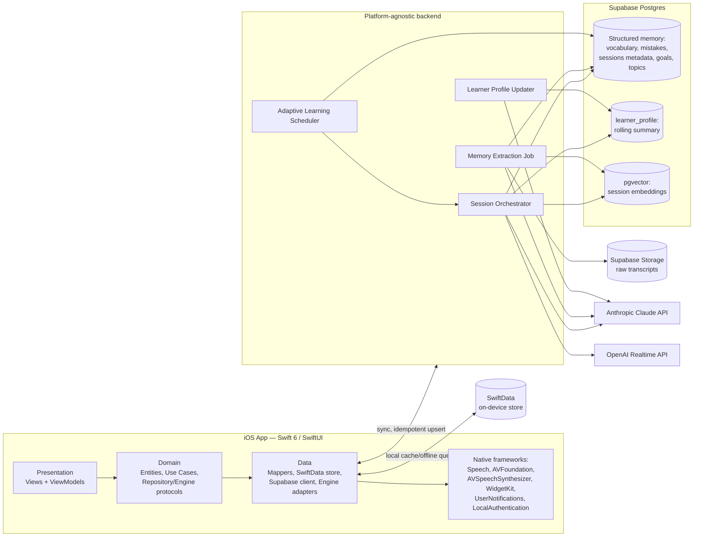

# ARCHITECTURE.md

Technical architecture for the personal AI English coach. Complements `PROJECT.md` (why) with the how. Implements confirmed decisions D1–D4 (`PROJECT.md` §8) plus the improvements approved in the 2026-08-06 Architecture Review — see `ARCHITECTURE_DECISIONS.md` for the full rationale behind every decision referenced here as `ADR-xxx`.

**Status: Frozen for Phase 0 implementation start**, pending nothing further — all required changes from the review are incorporated below.

---

## 1. Platform target

- **Client**: native iOS app, **Swift 6**, **SwiftUI**, minimum deployment target **iOS 18**. Fresh Xcode project inside this repository, replacing the prior Expo/React Native scaffold entirely (ADR-001).
- Swift 6 strict concurrency adopted from day one, not opted out of.
- Android/Web out of scope for v1. A future **macOS** app is treated as a near-term possibility, not a distant one, because SwiftData and this entire Domain/Data layer run unmodified on macOS — see §7 and ADR-013.

## 2. Architecture pattern: MVVM + Clean Architecture

Three layers, dependencies point inward (Presentation → Domain ← Data); **Domain has no knowledge of SwiftUI, SwiftData, Supabase, or any vendor SDK — not even indirectly.** This last point was the main finding of the architecture review (see below) and is now enforced structurally, not just described.

```
Presentation/   SwiftUI Views + ViewModels (@Observable), per feature (Onboarding, Chat, Voice, Progress)
Domain/         Entities, Use Cases, Repository protocols, Engine protocols — pure Swift, framework-free
Data/           Repository implementations, Mappers, SwiftData store, Supabase client, Engine adapters
```

### 2.1 Finding from the review: Presentation must not touch SwiftData directly

The original draft implied ViewModels reading from SwiftData "for instant offline UI" — that is a Clean Architecture violation: SwiftData's `@Model` types are a framework/persistence detail and must not leak past the Data layer. **Fixed by introducing Repository protocols in Domain**, implemented in Data by a class that internally decides whether to answer from SwiftData (fast path) or trigger a Supabase fetch, without the caller ever knowing:

```swift
// Domain — framework-free
protocol SessionRepository {
    func fetchRecent(limit: Int, offset: Int) async throws -> [Session]
    func save(_ session: Session) async throws
    func observeLocal() -> AsyncStream<[Session]>   // reactive UI updates
}

protocol MemoryRepository {
    func recentMistakes(limit: Int) async throws -> [Mistake]
    func vocabulary(due: Bool) async throws -> [VocabularyItem]
    func topicCoverage() async throws -> [Topic]
}

protocol SyncCoordinating {
    func syncNow() async throws
    var pendingChangesCount: Int { get async }
}
```

```swift
// Data — the only layer allowed to import SwiftData or the Supabase SDK
final class DefaultSessionRepository: SessionRepository {
    private let local: SwiftDataSessionStore
    private let remote: SupabaseSessionAPI
    private let mapper = SessionMapper.self
    // reads local first, writes local + queues remote, never exposes CachedSession to callers
}
```

A small **Mapper** layer (`SessionMapper`, `VocabularyMapper`, …) is responsible for converting between the SwiftData `@Model` type, the pure `Domain.Entity` type, and the Supabase DTO — each conversion lives in exactly one place, so a schema change touches one mapper, not every ViewModel.

### 2.2 Use cases (initial set — enumerated so implementation doesn't drift into ad hoc access patterns)

`StartSessionUseCase`, `EndSessionUseCase`, `GetAdaptiveFocusUseCase`, `SyncMemoryUseCase`, `SearchMemoryUseCase`, `ExportUserDataUseCase`, `DeleteUserDataUseCase`. Each takes its repository/engine dependencies via initializer injection — no singletons, no service locator (ADR-012).

### 2.3 Dependency Injection: composition root, no DI framework

A single `AppContainer`, built once at app launch, constructs every concrete repository/engine/mapper and injects them into use cases and ViewModels via plain initializers:

```swift
@main
struct CoachApp: App {
    let container = AppContainer()   // the only place concrete types are instantiated
}
```

No third-party DI container, no property-wrapper magic, no service locator — for a solo-maintained, multi-year codebase, explicit constructor injection is the cheapest thing to *read* correctly five years from now, which matters more here than the convenience a DI framework buys on a larger team (ADR-012).

### 2.4 SOLID / DDD assessment

| Principle | Assessment | Action |
|---|---|---|
| SRP | Engine and Repository protocols are single-purpose | Kept as-is |
| OCP | Provider swap = new Data adapter, no Domain/Presentation change | Kept as-is |
| LSP | Untested until a second concrete adapter exists per protocol | Recommended: build a minimal second `ConversationEngine` adapter early as a proof, not just in theory (see `TASKS.md` T0-13) |
| ISP | Protocols already narrow (no fat "AIService" god-protocol) | Kept as-is |
| DIP | Was violated by direct SwiftData access from Presentation | **Fixed** — §2.1 |
| DDD | Full DDD (aggregates, domain events, ubiquitous language) is more ceremony than a single-user app needs | Pragmatic subset only: typed value objects (`CEFRLevel`, `MasteryLevel`, `SessionCategory` as enums, already present) plus one lightweight domain event, `SessionCompletedEvent`, so "session ended" and "trigger sync + extraction" are decoupled rather than hard-wired inside `EndSessionUseCase` — recommended, not mandatory (`TASKS.md` T1-11) |

## 3. High-level system



Unchanged principle: the client never talks to Claude or the Realtime API directly; keys live only in the backend.

## 4. Local persistence & sync (SwiftData ↔ Supabase)

**Supabase Postgres remains the sole source of truth.** SwiftData is a durable local cache plus offline write queue. Four fixes from the review are now part of the design, not left implicit:

1. **Idempotent writes.** Every upload from `SyncCoordinator` is a Postgres `upsert` keyed on a stable client-generated UUID (`localID`, sent as the row's primary key candidate), not a bare insert. An interrupted upload that retries can never create a duplicate row — this was previously an unstated assumption and is now a hard requirement (`TASKS.md` T1-03).
2. **Per-device sync cursor.** A local `SyncState` record (SwiftData) stores `lastSyncedAt`; pulls request only rows changed since that watermark, paginated (not "pull everything since forever" after a long offline stretch). A companion `device_sync_state` table server-side (below) records the same watermark per device for diagnostics and to prepare for a second device (iPad, future Mac) without redesigning sync — recommended for Phase 1, required once a second device exists.
3. **Derived, not synced, streaks.** `streaks.current_streak_days` / `longest_streak_days` are **computed from `sessions.started_at`**, not stored as an independently mutable field. This removes an entire class of sync conflicts (two devices both trying to "own" the current streak count) by construction rather than by conflict-resolution rules.
4. **Hybrid realtime + pull sync.** Lightweight, high-value fields (streak, "new achievement") use a Supabase Realtime subscription for near-instant cross-device reflection; bulk data (sessions, vocabulary, mistakes) uses the watermark-based pull to keep network usage low and predictable.

Conflict resolution (unchanged from the prior draft where still applicable):
- *Append-only tables* (`sessions`, `vocabulary_items`, `mistakes` as new occurrences) — no merge needed, new rows just insert.
- *Mutable aggregate fields* (`topics.status`, `goals.achieved`, vocabulary `mastery_level`) — server `updated_at` wins, paired with a non-blocking UI notice so a resolution is never silent.
- Memory Extraction only ever runs server-side, after a transcript successfully uploads; an offline session queues for extraction rather than attempting it on-device.

**Recovery paths:**
- Interrupted sync → retried on next connectivity with exponential backoff; idempotent upserts make retries safe.
- Corrupted/unreadable local SwiftData store → detected at launch, local cache is rebuilt from Supabase (source of truth), not treated as data loss.
- Schema evolution → SwiftData `VersionedSchema` + `SchemaMigrationPlan` for the local store; Postgres changes ship as versioned migration files (Supabase CLI), additive-only by default; destructive changes require a reviewed backfill script tested against a data copy first.

**Backup & restore (made concrete — was vague in the original draft):**
- Supabase point-in-time recovery enabled (accepted cost trade-off under the moderate budget, D4 — data durability outranks this specific saving).
- A weekly scheduled export (Edge Function → structured JSON, uploaded to Supabase Storage **and** mirrored to a second location, e.g. Julia's own iCloud Drive) so a Supabase account-level incident is not a single point of failure for years of memory — this also directly serves the brief's "continue improving for years without changing platforms" success criterion by giving Julia a personally-owned copy of her data at any time.

## 5. Core subsystems

### 5.1 Conversation orchestration

Unchanged flow: load context → ask the Adaptive Learning Scheduler what to prioritize → stream a Claude conversation or issue an ephemeral Realtime token → enqueue Memory Extraction on session end (now via `SessionCompletedEvent`, §2.4).

### 5.2 Long-term memory (Principle 1) — revised: hierarchical, not flat

The original design used one summary + one embedding per session as the only "compressed" memory layer. At the brief's own stated horizon — **years, thousands of sessions** — that flat model degrades: context building has to search/rank an ever-larger pile of individually small facts. The review's main upgrade:

- **`learner_profile`** — a single, continuously-updated compact document per user ("who Julia is as a learner": strengths, recurring weaknesses, professional context, tone preferences), updated incrementally by a **Learner Profile Updater** job after each session (a cheap, targeted Claude call — merge new facts into the existing profile, not regenerate from scratch). This is included in **every** session's context by default, giving the coach a strong "knows me" baseline even before any topic-specific retrieval runs.
- **Session-level structured + semantic memory** (as before) is used for targeted retrieval on top of the profile — "what exactly did we cover about performance reviews" still goes through `pgvector` + structured filters, not the profile.
- Weekly/monthly rollup summaries are **not** built in v1 (would be premature per Principle 5) but the schema and job structure make adding them later additive, not a redesign — noted as a natural next step if the single-profile approach ever proves insufficient at multi-year scale.

Retrieval is **hybrid**, not pure vector search: filter by category/topic/recency first, then rank by embedding similarity within that filtered set — more precise and cheaper than searching the full embedding space every time.

### 5.3 Adaptive learning engine (Principle 2 & 3)

Unchanged scoring approach; `GetAdaptiveFocusUseCase` now also accepts an optional **upcoming real-world event** input (e.g., "interview next Tuesday") even though no UI surfaces it in Phase 0–3 — reserving this parameter now avoids a breaking Domain change when the proactive-event-prep feature (§11) is built later.

```
priority(topic) = w1 * recency_decay(last_seen)
                + w2 * error_frequency(topic)
                + w3 * topic_weight(business=0.7, daily=0.3)
                + w4 * user_stated_goal_boost
                + w5 * upcoming_event_boost   -- new, defaults to 0 until the feature ships
                - w6 * mastery_level(topic)
```

### 5.4 Voice conversation layer (Principle 4)

- **Primary**: OpenAI Realtime API, seeded with `learner_profile` + adaptive focus.
- **Fallback**: Speech framework + `AVSpeechSynthesizer`, native and offline-capable.
- **New from the review:**
  - Explicit **latency budget** as an acceptance criterion, not just a vibe: target first-audio-response under ~800ms perceived round-trip for the Realtime path; text first-token under ~2s.
  - **Reconnection before fallback**: a dropped Realtime session retries briefly (short backoff) before switching to the native path, so a momentary network blip doesn't downgrade a whole session unnecessarily.
  - **Interruption handling**: `AVAudioSession` interruption notifications (phone call, Siri, etc.) pause the session and persist whatever partial transcript exists immediately — a session interrupted mid-sentence must not lose what was already said, per Principle 1 applied to live sessions, not just completed ones.
  - **Voice consistency**: one fixed voice/persona is selected and reused across all sessions (not randomized per session) — consistency reads as "the same coach", which matters for the "knows me personally" feel (Principle 1/3).

### 5.5 Progress tracking & dashboard

Unchanged: read-only SwiftUI views over the local cache, now reached through `MemoryRepository` (§2.1) rather than SwiftData directly.

## 6. Backend & platform independence

Unchanged core approach (Supabase Edge Functions as an owned, versioned API) with one addition: the **Domain + Data layers are structured as a separate Swift Package** (working name `CoachKit`) from day one, even though only one app target consumes it in v1. This costs nothing now and is exactly what a future macOS app needs to reuse without duplicating business logic — SwiftData and Swift concurrency both run natively on macOS, so `CoachKit` would need zero changes, only a new macOS-specific Presentation target (ADR-013). Web/Android, if ever pursued, cannot reuse `CoachKit` (different language/runtime) but face no redesign either, since they'd talk to the same backend API `CoachKit` already talks to.

## 7. Security & privacy

Everything from the prior draft (Keychain session tokens, SwiftData Data Protection, Supabase RLS + encryption at rest, API-tier data-usage policy verification, reversible export/delete) still applies, plus:

- **App-level biometric lock** (Face ID/Touch ID via `LocalAuthentication`) gates access to the app itself, independent of the Supabase session token — defense-in-depth given the content (HR-sensitive workplace conversations) is more sensitive than a typical personal app's, and the marginal cost of adding it is small.
- **Certificate pinning: deliberately not used** (ADR-010) — standard TLS/App Transport Security is judged sufficient for this threat model (personal app, reputable API providers), and pinning's maintenance burden (cert rotation breaking the app) is a worse long-term reliability risk for a solo-maintained, multi-year project than the marginal MITM protection it buys.
- Backend secrets (Anthropic, OpenAI, Supabase service role) live in Supabase Edge Function environment secrets, rotated periodically — added as an explicit task rather than assumed.
- Raw transcripts are deliberately excluded from the local SwiftData cache (unchanged from the original draft) — this is now doubly justified: it shrinks the on-device sensitive-data surface *and* keeps the local store small as history grows (§9).

## 8. Native iOS integration

| Framework | Use | Serves |
|---|---|---|
| Speech | On-device speech recognition, offline voice fallback | Principle 4, continuity |
| AVFoundation | Audio session/recording, interruption handling | Voice reliability |
| AVSpeechSynthesizer | Local TTS fallback | Continuity, cost control (D4) |
| WidgetKit | Home-screen streak/progress widget | Principle 2 reinforcement, premium feel |
| UserNotifications | Native daily reminder/streak notifications | Habit formation over years |
| LocalAuthentication | Face ID/Touch ID app-lock | Defense-in-depth for sensitive content (§7) |
| Accessibility (VoiceOver, Dynamic Type) | Inclusive, polished UX | Principle 6 |

## 9. Data model

### 9.1 Supabase Postgres (source of truth)

```sql
create table users (
  id uuid primary key references auth.users,
  name text not null,
  professional_role text,
  primary_goal text,
  cefr_level text,
  created_at timestamptz not null default now()
);

-- Raw transcripts moved OUT of this table (review finding) — see §9.3.
create table sessions (
  id uuid primary key,                 -- client-generated UUID (localID), enables idempotent upsert
  user_id uuid references users(id),
  started_at timestamptz not null default now(),
  ended_at timestamptz,
  mode text check (mode in ('text', 'voice')),
  category text check (category in ('business', 'daily')),
  topic text,
  transcript_storage_path text,        -- pointer into Supabase Storage, not inline text
  summary text,
  summary_embedding vector(1536),
  updated_at timestamptz not null default now()
);
create index idx_sessions_user_started on sessions(user_id, started_at desc);
create index idx_sessions_embedding on sessions using hnsw (summary_embedding vector_cosine_ops);

create table vocabulary_items (
  id uuid primary key,
  user_id uuid references users(id),
  term text not null,
  definition text,
  first_seen_session_id uuid references sessions(id),
  times_used int not null default 0,
  mastery_level text check (mastery_level in ('introduced','practicing','mastered')),
  last_practiced_at timestamptz,
  updated_at timestamptz not null default now()
);
create index idx_vocab_user_mastery on vocabulary_items(user_id, mastery_level);

create table mistakes (
  id uuid primary key,
  user_id uuid references users(id),
  type text check (type in ('grammar','pronunciation','vocabulary','fluency')),
  description text not null,
  example text,
  correction text,
  occurrences int not null default 1,
  last_seen_session_id uuid references sessions(id),
  resolved boolean not null default false,
  updated_at timestamptz not null default now()
);
create index idx_mistakes_user_resolved on mistakes(user_id, resolved, type);

create table topics (
  id uuid primary key,
  user_id uuid references users(id),
  name text not null,
  category text check (category in ('business','daily')),
  status text check (status in ('not_started','introduced','practicing','mastered')),
  last_covered_session_id uuid references sessions(id),
  updated_at timestamptz not null default now()
);

create table goals (
  id uuid primary key,
  user_id uuid references users(id),
  description text not null,
  target_date date,
  achieved boolean not null default false,
  updated_at timestamptz not null default now()
);

create table achievements (
  id uuid primary key default gen_random_uuid(),
  user_id uuid references users(id),
  label text not null,
  achieved_at timestamptz not null default now()
);

-- NEW: hierarchical memory profile (§5.2)
create table learner_profile (
  user_id uuid primary key references users(id),
  summary text not null,
  strengths text[],
  weaknesses text[],
  version int not null default 1,
  updated_at timestamptz not null default now()
);

-- NEW: per-device sync diagnostics (§4)
create table device_sync_state (
  device_id uuid primary key,
  user_id uuid references users(id),
  platform text,                       -- 'ios' | future: 'macos'
  last_synced_at timestamptz,
  created_at timestamptz not null default now()
);

-- CHANGED: streaks is now a view derived from sessions, not an editable table (§4)
create view streaks as
select
  user_id,
  -- current/longest streak computed via date-gap-island window functions over started_at::date
  -- (implementation detail for Phase 1; contract is: always derived, never independently written)
  user_id as _placeholder_see_note
from sessions
group by user_id;
```

### 9.2 SwiftData (local cache, illustrative)

```swift
@Model
final class CachedSession {
    @Attribute(.unique) var localID: UUID
    var remoteID: UUID?
    var startedAt: Date
    var mode: String
    var category: String
    var topic: String?
    var summary: String?          // transcript itself is NOT cached locally, by design
    var syncStatus: SyncStatus
}

enum SyncStatus: String, Codable { case synced, pendingUpload, pendingExtraction }

@Model
final class SyncState {
    var lastSyncedAt: Date?
    var deviceID: UUID
}
```

### 9.3 Object storage

Raw transcripts move from an inline `sessions.transcript_raw` column to **Supabase Storage** (`transcripts/{user_id}/{session_id}.txt`), referenced by `transcript_storage_path`. This keeps the hot `sessions` table — queried on every scheduler run and every progress view — lean regardless of how many years of verbose voice transcripts accumulate, and makes "nothing disappears without permission" (Principle 1) compatible with "queries stay fast at scale" (§11) instead of trading one off against the other.

## 10. Tech stack summary

| Layer | Choice | Rationale |
|---|---|---|
| Client platform | Swift 6, SwiftUI, iOS 18+ | Native performance, system integration, longevity (D1) |
| Architecture | MVVM + Clean Architecture, Repository + Engine protocols | Testable, keeps AI providers and persistence swappable |
| Local persistence | SwiftData | Modern, native, offline cache |
| Backend | Supabase Edge Functions (Deno/TS), packaged as an owned versioned API | Low-ops, platform-agnostic contract |
| Database | Supabase Postgres + `pgvector` (HNSW index) | Structured + semantic memory, source of truth |
| Object storage | Supabase Storage | Keeps raw transcripts out of hot query tables |
| Auth | Supabase Auth + iOS Keychain + Face ID app-lock | Layered security appropriate to sensitive content |
| Reasoning/generation LLM | Anthropic Claude API | Primary conversation/content/profile-update engine |
| Voice (primary) | OpenAI Realtime API | Most mature low-latency voice-to-voice option |
| Voice (fallback) | Speech framework + AVSpeechSynthesizer | Native, offline-capable, cost-conscious |
| Notifications/widgets | UserNotifications, WidgetKit | Native habit reinforcement, premium feel |
| CI | GitHub Actions (macOS runner) | Regression safety net for a solo-maintained project |

## 11. Scalability at the brief's own stated horizon

The brief explicitly targets years of daily use; this section validates the design against that, not against typical MVP scale:

| Scenario | Risk without mitigation | Mitigation already in this design |
|---|---|---|
| Thousands of hours of conversation | Hot tables bloated with transcript text | Transcripts in object storage (§9.3), not inline |
| Hundreds of thousands of messages | No current per-message table | Deliberately deferred (Principle 5) — session-level summary + embedding is sufficient for retrieval today; a normalized `messages` table is additive if fine-grained search-within-a-conversation is ever needed |
| Thousands of vocabulary/mistake rows | Slow scheduler queries | Indexes on `(user_id, status/mastery)` (§9.1) |
| Multi-year embedding growth | Exact vector search slows down | HNSW index on `summary_embedding` |
| Multiple devices | Sync conflicts, duplicate rows, "who owns the streak" ambiguity | Idempotent upsert, per-device cursor, derived streaks (§4) |
| Future macOS/Web client | Business logic duplicated per platform | `CoachKit` Swift Package (Domain+Data) reusable on macOS; backend API reusable by any platform (§6) |
| Growing context needed per session | Token cost/latency creep as memory grows | Hierarchical memory (`learner_profile` + targeted retrieval, §5.2), bounded top-k, hybrid filter-then-rank retrieval |

## 12. Testability

- Domain layer (Use Cases, Entities) is pure Swift with protocol dependencies — unit-testable with hand-written mocks, no SwiftData/network involved.
- Data layer integration tests use an in-memory `ModelContainer` (SwiftData's built-in test configuration) rather than mocking SwiftData itself.
- Critical flows (onboarding, start/end a session, voice fallback trigger) get XCUITest coverage; exhaustive UI coverage is not a goal (Principle 5 applies to the test suite too).
- CI (GitHub Actions, macOS runner) runs the unit test suite on every push — a concrete continuity measure against R-04 (single-maintainer risk).

## 13. Performance

- **Startup**: heavy dependencies (Realtime SDK) lazy-initialized only when the voice screen opens; local SwiftData schema stays small because transcripts are never cached locally.
- **Battery**: background sync scheduled conservatively via `BGTaskScheduler` (hours, not minutes) plus foreground/background lifecycle triggers, rather than aggressive polling.
- **Queries**: all list views use predicates + pagination (limit/offset via `SessionRepository.fetchRecent`), never "load every session."
- **Rendering**: SwiftUI's native list virtualization; a past session's full transcript loads on demand from Supabase Storage, never prefetched in bulk.

## 14. Observability

- Token usage/cost logged per session (Claude + Realtime) in the backend, supporting D4's "avoid unnecessary calls" mandate with real data.
- `OSLog` + `MetricKit` as the first-choice native diagnostics tooling, before reaching for a third-party SDK.
- Latency budgets from §5.4 tracked as a metric, not just a design intent, so regressions are visible.

## 15. Open technical decisions

- Exact `BGTaskScheduler` interval tuning (needs real battery-impact data, not guessable upfront).
- Whether/when weekly or monthly rollup summaries are added on top of `learner_profile` (§5.2) — deferred until single-profile retrieval proves insufficient.
- CEFR-based onboarding assessment design.
- Raw transcript retention window in Storage (kept forever vs. pruned after N years) — Principle 1 default is "forever," revisit only if storage cost ever becomes material under D4.
- iOS distribution mechanism for years-long personal use (`RISKS.md` R-07) — still pending Julia's confirmation.
