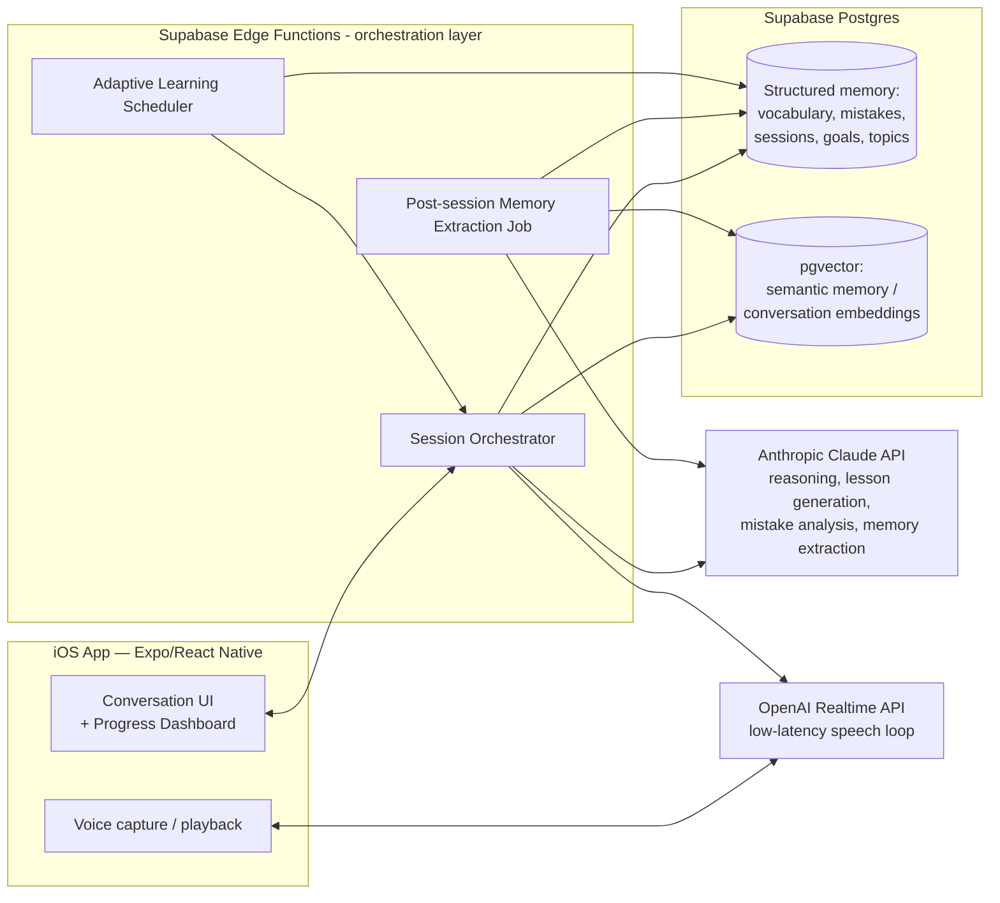

# ARCHITECTURE.md

Technical architecture for the personal AI English coach. Complements `PROJECT.md` (why) with the how. Assumes decisions D1–D4 in `PROJECT.md` §8 unless noted as still open.

---

## 1. Platform target

- **Client**: iOS, built with **Expo (SDK 57)** + **React Native** + **TypeScript**, reusing the existing `elo-app` repo's technical scaffold (React Navigation, `expo-linear-gradient`, `expo-blur`, `react-native-svg`).
  - Per `AGENTS.md`, Expo SDK 57 changed significantly from prior versions — all implementation must be checked against `https://docs.expo.dev/versions/v57.0.0/` at build time, not against older training knowledge.
- All fitness-domain code (`src/screens/*`, `src/data/mockData.ts`, `src/theme/sports.ts`, fitness-specific types in `src/types.ts`) is removed in Phase 1; navigation shell, theming approach, and component patterns (cards, toasts, toggles, screen container) are kept as a starting point since they already meet the "everything should feel premium" principle.
- Android is out of scope (brief specifies iOS only, personal use).

## 2. High-level system



Key principle: **the client never talks to Claude or the Realtime API directly.** API keys live only in the Supabase Edge Functions layer. This matters even for a personal app — an IPA can be inspected, and a leaked key on a device used for years is a real liability, not a theoretical one.

## 3. Core subsystems

### 3.1 Conversation orchestration

A thin backend layer (Supabase Edge Functions, Deno/TypeScript) that, per session:

1. Loads the user's current memory snapshot (structured facts + top-k semantically relevant past conversation summaries via `pgvector` similarity search).
2. Asks the **Adaptive Learning Scheduler** what today's session should prioritize (topic, difficulty, business/daily ratio, specific mistakes to target).
3. Builds a system prompt/context package and starts either:
   - a **text conversation** with Claude (Phase 1–3), or
   - a **voice session** via the OpenAI Realtime API, seeded with the same context (Phase 4+).
4. Streams the response back to the client.
5. On session end, enqueues the **Memory Extraction Job**.

### 3.2 Long-term memory (Principle 1)

Two tiers, both required — one alone doesn't satisfy "remember everything":

- **Structured memory** (Postgres tables, see §5) — precise, queryable, drives the adaptive scheduler. Example: "mistake: confuses `since`/`for`, occurred 4 times, last seen 12 days ago."
- **Semantic memory** (`pgvector` embeddings over conversation summaries, one row per session) — fuzzy recall for things that don't fit a rigid schema. Example: "the time we role-played the layoff conversation" is retrievable by meaning, not by exact tag.

A **Memory Extraction Job** (Claude, run async after each session, not blocking the UI) reads the raw transcript and:
- extracts new vocabulary/expressions used or taught
- logs grammar/pronunciation mistakes (type, example, correction)
- updates topic coverage status (introduced / practiced / mastered)
- writes a session summary + embedding
- updates streak/confidence/speaking-speed metrics where inferable

Raw transcripts are retained (Principle 1: nothing disappears without explicit permission) but are not the primary data used for future context — the structured + summarized layers are, to keep prompt context bounded and cheap as history grows across years.

### 3.3 Adaptive learning engine (Principle 2 & 3)

A scoring function over the structured memory, re-evaluated at the start of each session (not a heavyweight ML model — a transparent, tunable heuristic, since explainability matters for a coach the user trusts for years):

```
priority(topic) = w1 * recency_decay(last_seen)
                + w2 * error_frequency(topic)
                + w3 * topic_weight(business=0.7, daily=0.3)
                + w4 * user_stated_goal_boost
                - w5 * mastery_level(topic)
```

Output feeds two things:
- **Per-session focus** (which mistakes to target, what difficulty).
- **Weekly HR scenario generator** (Principle: brief §7 — "every week, the AI should generate situations related to Human Resources") — a scheduled job that produces a themed role-play scenario (e.g., interview, performance review, conflict resolution) not recently covered, generated fresh by Claude rather than picked from a static bank, per Principle 3 ("no generic lessons").

### 3.4 Voice conversation layer (Principle 4)

- OpenAI Realtime API handles the live speech-to-speech loop (recommended for latency/naturalness — see `PROJECT.md` D2).
- Session is seeded with instructions derived from the memory snapshot and today's adaptive focus, so the *voice* model doesn't need its own memory system — Claude + Postgres remain the single source of truth.
- Pronunciation feedback: captured via transcript + confidence signals from the voice session, logged into structured memory as pronunciation mistakes.
- **This is the highest-risk, least-proven part of the architecture** for this project (see `RISKS.md` R-01) and is deliberately scheduled after the text-based coach is solid (Phase 4), so Principle 1/2/3 memory infrastructure is validated before adding voice complexity.

### 3.5 Progress tracking & dashboard

Read-only views over structured memory: streaks, vocabulary growth over time, mistakes resolved vs. recurring, topics mastered vs. to-review, level trend. No new data model beyond §5 — this is a query/visualization layer on the client.

## 4. Tech stack summary

| Layer | Choice | Rationale |
|---|---|---|
| Client framework | Expo SDK 57 + React Native + TypeScript | Reuses existing scaffold; Expo simplifies iOS builds/OTA updates for a solo maintainer |
| Navigation | React Navigation (existing) | Already integrated |
| Client state/data | TanStack Query (new) | Caching + offline resilience against Supabase, avoids hand-rolled fetch/loading state |
| Backend orchestration | Supabase Edge Functions (Deno/TS) | Keeps API keys server-side; no separate server to operate |
| Database | Supabase Postgres + `pgvector` | Managed, durable, supports both structured and semantic memory in one system |
| Auth | Supabase Auth | Even single-user, needed for secure device access + future multi-device |
| Reasoning/generation LLM | Anthropic Claude API | Strong reasoning, tool use, prompt caching for large recurring context (memory snapshot) |
| Voice | OpenAI Realtime API | Most mature low-latency voice-to-voice option available today |
| Push/reminders | Expo Notifications | Supports streak/habit reinforcement (Principle 2, daily use over years) |

## 5. Data model (initial sketch — refined in Phase 1)

```sql
create table users (
  id uuid primary key references auth.users,
  name text not null,
  professional_role text,       -- e.g. "Human Resources"
  primary_goal text,             -- e.g. "fluency for multinational companies"
  cefr_level text,                -- assessed, not self-reported; nullable until onboarding
  created_at timestamptz not null default now()
);

create table sessions (
  id uuid primary key default gen_random_uuid(),
  user_id uuid references users(id),
  started_at timestamptz not null default now(),
  ended_at timestamptz,
  mode text check (mode in ('text', 'voice')),
  category text check (category in ('business', 'daily')),
  topic text,
  transcript_raw text,             -- retained per "never forget without permission"
  summary text,                    -- Claude-generated, used for future context
  summary_embedding vector(1536)   -- pgvector, semantic recall
);

create table vocabulary_items (
  id uuid primary key default gen_random_uuid(),
  user_id uuid references users(id),
  term text not null,
  definition text,
  first_seen_session_id uuid references sessions(id),
  times_used int not null default 0,
  mastery_level text check (mastery_level in ('introduced','practicing','mastered')),
  last_practiced_at timestamptz
);

create table mistakes (
  id uuid primary key default gen_random_uuid(),
  user_id uuid references users(id),
  type text check (type in ('grammar','pronunciation','vocabulary','fluency')),
  description text not null,        -- e.g. "confuses since/for"
  example text,
  correction text,
  occurrences int not null default 1,
  last_seen_session_id uuid references sessions(id),
  resolved boolean not null default false
);

create table topics (
  id uuid primary key default gen_random_uuid(),
  user_id uuid references users(id),
  name text not null,               -- e.g. "Performance Reviews"
  category text check (category in ('business','daily')),
  status text check (status in ('not_started','introduced','practicing','mastered')),
  last_covered_session_id uuid references sessions(id)
);

create table goals (
  id uuid primary key default gen_random_uuid(),
  user_id uuid references users(id),
  description text not null,
  target_date date,
  achieved boolean not null default false
);

create table achievements (
  id uuid primary key default gen_random_uuid(),
  user_id uuid references users(id),
  label text not null,
  achieved_at timestamptz not null default now()
);

create table streaks (
  user_id uuid primary key references users(id),
  current_streak_days int not null default 0,
  longest_streak_days int not null default 0,
  last_session_date date
);
```

This schema is deliberately normalized and explainable (not a black-box vector-only store) so that, per Principle 1, "remembering everything" is auditable — Julia can, in principle, query her own learning history directly.

## 6. Security & privacy

Even for a single-user personal app:
- No API keys (Anthropic, OpenAI, Supabase service role) ever ship in the client bundle — Edge Functions only.
- Supabase Row Level Security scoped to the authenticated user, even with one user, to avoid rework if the trust model ever changes.
- Conversation transcripts contain personal/professional information (HR scenarios may reference real workplace situations) — treated as sensitive data at rest (Supabase encryption at rest) and never used for third-party model training (must be confirmed against Anthropic/OpenAI data-usage policies for API — not consumer — tiers, which by default do not train on API data).
- Data export/delete flow required to honor "nothing disappears without explicit permission" as a *reversible* guarantee — deletion must be a deliberate, confirmed user action, not automatic.

## 7. Observability

- Token usage and estimated cost logged per session (Claude + Realtime API), surfaced in a simple internal metrics view — supports revisiting D4 (budget) later with real data instead of guesses.
- Basic error tracking (e.g., Sentry free tier) given this app will run unattended for years and issues must surface, not silently degrade memory capture.

## 8. Open technical decisions

Tracked in `RISKS.md` and `TASKS.md`, not resolved here:
- Final choice/validation of OpenAI Realtime API vs. alternatives (see `RISKS.md` R-01).
- iOS distribution mechanism for years-long personal use (see `RISKS.md` R-07).
- CEFR-based onboarding assessment design.
- Data retention window for raw transcripts (kept forever vs. summarized-then-pruned after N months).
