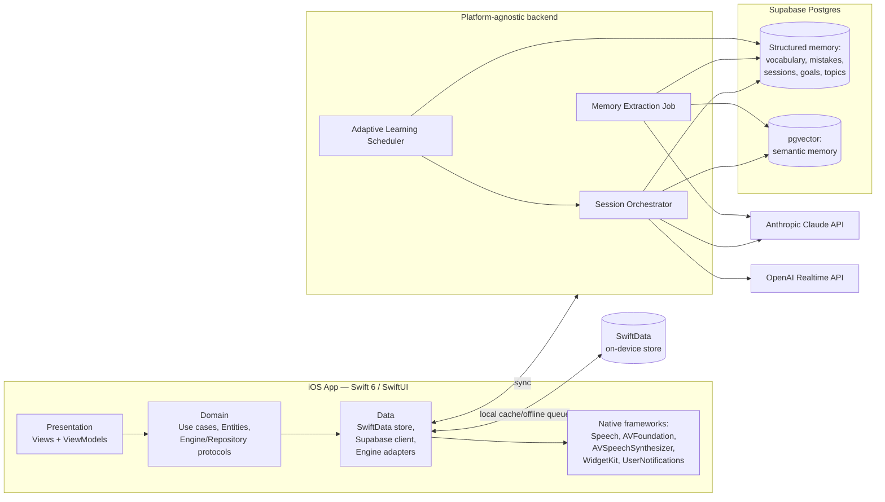

# ARCHITECTURE.md

Technical architecture for the personal AI English coach. Complements `PROJECT.md` (why) with the how. Implements confirmed decisions D1–D4 (`PROJECT.md` §8).

---

## 1. Platform target

- **Client**: native iOS app, **Swift 6**, **SwiftUI**, minimum deployment target **iOS 18**. Built as a fresh Xcode project inside this repository, replacing the prior Expo/React Native scaffold entirely — that scaffold belonged to an unrelated project and is not migrated, adapted, or referenced.
- Swift 6's strict concurrency checking is adopted from day one (not opted out of) — for a codebase meant to last years, starting with the strictest available data-race safety is cheaper than retrofitting it later.
- Android/Web/Desktop are explicitly out of scope for v1, but the **backend is built to not assume an iOS-only client** (see §6), so those remain additive later, not a rewrite.

## 2. Architecture pattern: MVVM + Clean Architecture

Three layers, dependencies point inward (Presentation → Domain ← Data); Domain has no knowledge of SwiftUI, Supabase, or any vendor SDK:

```
Presentation/            SwiftUI Views + ViewModels (@Observable), per-feature (Onboarding, Chat, Voice, Progress)
Domain/                  Use cases (interactors), Entities (plain Swift types), Repository & Engine protocols
Data/                    Repository implementations, SwiftData store, Supabase client, network/API adapters
```

This split is what makes decision D2's provider-swapping requirement real rather than aspirational: **Domain defines protocols, Data implements them against a specific vendor.** Swapping Claude or the Realtime API for another provider later means writing a new Data-layer adapter — Presentation and Domain code do not change.

```swift
// Domain layer — vendor-agnostic
protocol ConversationEngine {
    func respond(to context: SessionContext) async throws -> AsyncStream<ConversationChunk>
}

protocol VoiceEngine {
    func startSession(seededWith context: SessionContext) async throws -> VoiceSession
}

protocol MemoryExtractionEngine {
    func extract(from transcript: Transcript) async throws -> MemoryUpdate
}

// Data layer — one concrete adapter per provider, injected at composition root
final class ClaudeConversationEngine: ConversationEngine { /* calls backend, not Anthropic directly */ }
final class OpenAIRealtimeVoiceEngine: VoiceEngine { /* calls backend-issued ephemeral token */ }
```

## 3. High-level system



Key principle unchanged from the initial pass: **the client never talks to Claude or the Realtime API directly.** API keys live only in the backend layer. The backend is deliberately treated as "our own service" (§6) — a thin proxy — rather than the client hitting Supabase's auto-generated API directly for anything AI-related, since that's the layer a future Web/Desktop client would also depend on.

## 4. Local persistence & sync (SwiftData ↔ Supabase)

**Supabase Postgres is the sole source of truth.** SwiftData is a durable local cache plus an offline write queue — never a competing authority. This distinction drives every rule below.

- **SwiftData models** mirror the subset of the server schema needed on-device: `Session`, `VocabularyItem`, `Mistake`, `Topic`, `Goal`, `Streak`. Each carries two client-only fields: `localID: UUID` (stable identity before a server ID exists) and `syncStatus: SyncStatus` (`synced` / `pendingUpload` / `pendingExtraction`).
- **Write path (offline-first)**: user actions (finishing a session, onboarding answers) write to SwiftData immediately, marked `pendingUpload`. A `SyncCoordinator` uploads pending writes to Supabase when connectivity is available (foreground trigger + `BGTaskScheduler` background refresh), then flips them to `synced`.
- **Read path**: ViewModels read from SwiftData for instant, offline-capable UI; the `SyncCoordinator` pulls remote changes (via an `updated_at` watermark, or Supabase Realtime subscriptions where latency matters, e.g. cross-device continuity later) and merges them into SwiftData in the background.
- **Conflict resolution strategy** (concrete, not left as "sync automatically"):
  - *Append-only tables* (`sessions`, `vocabulary_items`, `mistakes` as new occurrences) — conflicts are structurally rare: new local rows just insert remotely. No merge logic needed.
  - *Mutable aggregate fields* (`streaks.current_streak_days`, `topics.status`, `goals.achieved`, vocabulary `mastery_level`) — **server timestamp wins**. The server's `updated_at` is authoritative; a local pending write older than the server's current value is discarded and replaced by the pulled value, with a non-blocking UI notice ("synced from your other update") rather than a silent, invisible overwrite.
  - Memory Extraction (§5) only ever runs server-side, after a transcript successfully uploads — an offline voice/text session queues for extraction, it does not attempt extraction on-device.
- Local SwiftData store uses **iOS Data Protection** (`.completeUntilFirstUserAuthentication` or stricter) since it holds the same sensitive conversation content as the server (see §7).

## 5. Core subsystems

### 5.1 Conversation orchestration

A backend Session Orchestrator that, per session:

1. Loads the memory snapshot (structured facts + top-k semantically relevant past session summaries via `pgvector`).
2. Asks the **Adaptive Learning Scheduler** what today's session should prioritize (topic, difficulty, business/daily ratio, mistakes to target).
3. Streams a conversation via `ConversationEngine` (Claude) for text sessions, or issues an ephemeral token for `VoiceEngine` (OpenAI Realtime) seeded with the same context, for voice sessions.
4. On session end, enqueues the Memory Extraction Job.

### 5.2 Long-term memory (Principle 1)

Two tiers server-side (unchanged from the initial pass, now explicitly the authoritative copy behind the SwiftData cache described in §4):

- **Structured memory** — precise, queryable, drives the adaptive scheduler.
- **Semantic memory** (`pgvector` embeddings over session summaries) — fuzzy recall beyond rigid tags.

A **Memory Extraction Job** (Claude, async, server-side only) reads each transcript and updates vocabulary, mistakes, topic coverage, a session summary + embedding, and streak/confidence/speaking-speed metrics.

### 5.3 Adaptive learning engine (Principle 2 & 3)

Unchanged scoring approach:

```
priority(topic) = w1 * recency_decay(last_seen)
                + w2 * error_frequency(topic)
                + w3 * topic_weight(business=0.7, daily=0.3)
                + w4 * user_stated_goal_boost
                - w5 * mastery_level(topic)
```

Drives per-session focus and the weekly HR scenario generator (brief §7).

### 5.4 Voice conversation layer (Principle 4)

- **Primary path**: OpenAI Realtime API for live speech-to-speech, seeded with memory context from the backend.
- **Native fallback path**: when offline or the Realtime session fails to establish, the app falls back to the **Speech framework** (on-device recognition) for input and **AVSpeechSynthesizer** for output, running against a locally cached/last-known conversational context rather than blocking the user entirely. This is a direct benefit of going native (D1) that was not available in the original Expo-based plan.
- **AVFoundation** manages the audio session (category switching between recording and playback, interruption handling — e.g. phone calls).
- Pronunciation feedback is captured via transcript + confidence signals and logged into structured memory as pronunciation mistakes; this still requires the Realtime path (the on-device fallback is a continuity measure, not a feature-parity replacement).
- This remains the highest-risk, least-proven part of the architecture (see `RISKS.md` R-01) and stays scheduled after the text-based coach is solid (Phase 4).

### 5.5 Progress tracking & dashboard

Read-only SwiftUI views over the local SwiftData cache (instant, offline-capable): streaks, vocabulary growth, mistakes resolved vs. recurring, topics mastered vs. to-review, level trend.

## 6. Backend & platform independence

- The backend is implemented as **Supabase Edge Functions** (Deno/TypeScript) today — chosen for zero infrastructure to operate as a solo maintainer — but is treated architecturally as **"our own service"**: a versioned HTTP API that owns orchestration, AI provider calls, and sync endpoints. The iOS app is just one client of this API.
- This is what satisfies the "backend must remain platform-agnostic" requirement: a future Web/Desktop client talks to the same API and the same Postgres data, with no iOS-specific assumptions baked into the contract. If Edge Functions ever stop being sufficient (e.g. heavier compute, longer-running jobs), the API contract allows moving to a dedicated server without touching any client.
- All vendor API keys (Anthropic, OpenAI, Supabase service role) live only in this backend layer, never in the iOS app bundle or Keychain.

## 7. Security & privacy

- iOS app authenticates to the backend via Supabase Auth; session tokens are stored in the **iOS Keychain**, never `UserDefaults`.
- SwiftData local store uses iOS Data Protection (§4); Supabase provides encryption at rest.
- Supabase Row Level Security scoped to the authenticated user, even with one user today, to avoid rework if the trust model changes (e.g. future household/family accounts, or a Web client).
- Conversation transcripts contain personal/professional information (HR scenarios may reference real workplace situations) — must be verified against Anthropic/OpenAI API-tier (not consumer-tier) data-usage policies, which by default exclude API traffic from model training, but this must be confirmed at implementation time, not assumed indefinitely.
- Data export/delete flow required to honor "nothing disappears without explicit permission" as a *reversible* guarantee — deletion is a deliberate, confirmed action, propagated to both Supabase and the local SwiftData cache.

## 8. Native iOS integration (D1 follow-through)

Concrete uses of native frameworks, each tied to a principle or explicit user constraint rather than added for their own sake:

| Framework | Use | Serves |
|---|---|---|
| Speech | On-device speech recognition, offline voice fallback | Principle 4, continuity |
| AVFoundation | Audio session/recording management | Voice layer reliability |
| AVSpeechSynthesizer | Local TTS fallback when offline/Realtime unavailable | Continuity, cost control (D4) |
| WidgetKit | Home-screen streak/progress widget | Principle 2 reinforcement, "premium feel" (Principle 6) |
| UserNotifications | Native daily reminder/streak notifications | Habit formation over years |
| Accessibility (VoiceOver, Dynamic Type) | Inclusive, polished UX | Principle 6 (premium = accessible) |

## 9. Data model

### 9.1 Supabase Postgres (source of truth)

```sql
create table users (
  id uuid primary key references auth.users,
  name text not null,
  professional_role text,       -- e.g. "Human Resources"
  primary_goal text,             -- e.g. "fluency for multinational companies"
  cefr_level text,                -- assessed, not self-reported; nullable until onboarding
  created_at timestamptz not null default now()
);

create table sessions (
  id uuid primary key default gen_random_uuid(),
  user_id uuid references users(id),
  started_at timestamptz not null default now(),
  ended_at timestamptz,
  mode text check (mode in ('text', 'voice')),
  category text check (category in ('business', 'daily')),
  topic text,
  transcript_raw text,
  summary text,
  summary_embedding vector(1536),
  updated_at timestamptz not null default now()
);

create table vocabulary_items (
  id uuid primary key default gen_random_uuid(),
  user_id uuid references users(id),
  term text not null,
  definition text,
  first_seen_session_id uuid references sessions(id),
  times_used int not null default 0,
  mastery_level text check (mastery_level in ('introduced','practicing','mastered')),
  last_practiced_at timestamptz,
  updated_at timestamptz not null default now()
);

create table mistakes (
  id uuid primary key default gen_random_uuid(),
  user_id uuid references users(id),
  type text check (type in ('grammar','pronunciation','vocabulary','fluency')),
  description text not null,
  example text,
  correction text,
  occurrences int not null default 1,
  last_seen_session_id uuid references sessions(id),
  resolved boolean not null default false,
  updated_at timestamptz not null default now()
);

create table topics (
  id uuid primary key default gen_random_uuid(),
  user_id uuid references users(id),
  name text not null,
  category text check (category in ('business','daily')),
  status text check (status in ('not_started','introduced','practicing','mastered')),
  last_covered_session_id uuid references sessions(id),
  updated_at timestamptz not null default now()
);

create table goals (
  id uuid primary key default gen_random_uuid(),
  user_id uuid references users(id),
  description text not null,
  target_date date,
  achieved boolean not null default false,
  updated_at timestamptz not null default now()
);

create table achievements (
  id uuid primary key default gen_random_uuid(),
  user_id uuid references users(id),
  label text not null,
  achieved_at timestamptz not null default now()
);

create table streaks (
  user_id uuid primary key references users(id),
  current_streak_days int not null default 0,
  longest_streak_days int not null default 0,
  last_session_date date,
  updated_at timestamptz not null default now()
);
```

`updated_at` columns are added throughout (vs. the original draft) specifically to support the sync conflict-resolution rule in §4 — every syncable table needs a server-authoritative timestamp.

### 9.2 SwiftData (local cache, illustrative)

```swift
@Model
final class CachedSession {
    @Attribute(.unique) var localID: UUID
    var remoteID: UUID?
    var startedAt: Date
    var mode: String        // "text" | "voice"
    var category: String    // "business" | "daily"
    var topic: String?
    var summary: String?
    var syncStatus: SyncStatus
}

enum SyncStatus: String, Codable {
    case synced, pendingUpload, pendingExtraction
}
```

Local models intentionally omit `transcript_raw` and embeddings by default (kept server-side only) to avoid bloating the on-device store — full transcripts sync up but are not required to sync back down for the cache to be useful; only summaries and structured facts round-trip.

## 10. Tech stack summary

| Layer | Choice | Rationale |
|---|---|---|
| Client platform | Swift 6, SwiftUI, iOS 18+ | Confirmed (D1) — native performance, system integration, longevity |
| Architecture | MVVM + Clean Architecture | Confirmed (D1) — testable, keeps AI providers swappable (D2) |
| Local persistence | SwiftData | Confirmed (D3) — modern, native, offline cache |
| Backend | Supabase Edge Functions (Deno/TS) | Managed, low-ops, treated as an owned/versioned API for platform independence |
| Database | Supabase Postgres + `pgvector` | Structured + semantic memory in one system, source of truth |
| Auth | Supabase Auth + iOS Keychain | Secure session storage, ready for future multi-device/multi-client |
| Reasoning/generation LLM | Anthropic Claude API | Confirmed (D2) — primary conversation/content engine |
| Voice (primary) | OpenAI Realtime API | Confirmed (D2) — most mature low-latency voice-to-voice option |
| Voice (fallback) | Speech framework + AVSpeechSynthesizer | Native, offline-capable, cost-conscious (D4) |
| Notifications/widgets | UserNotifications, WidgetKit | Native habit reinforcement, premium feel |

## 11. Observability

- Token usage/cost logged per session (Claude + Realtime) in the backend, surfaced in a simple internal metrics view — directly supports D4's "avoid unnecessary API calls" mandate with real data instead of guesses.
- Native crash/diagnostics via Apple's own tooling (`OSLog`, `MetricKit`) as the first-choice option given the native platform, before reaching for a third-party SDK.

## 12. Open technical decisions

Tracked in `RISKS.md` and `TASKS.md`, not resolved here:
- Exact background-sync scheduling (`BGTaskScheduler` intervals) balancing freshness vs. battery/cost.
- CEFR-based onboarding assessment design.
- Data retention window for raw transcripts (kept forever vs. summarized-then-pruned after N months).
- iOS distribution mechanism for years-long personal use (see `RISKS.md` R-07).
